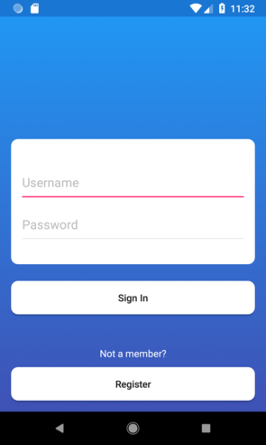
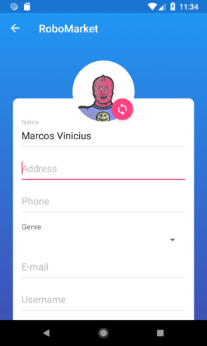
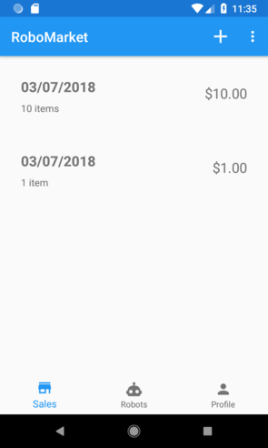
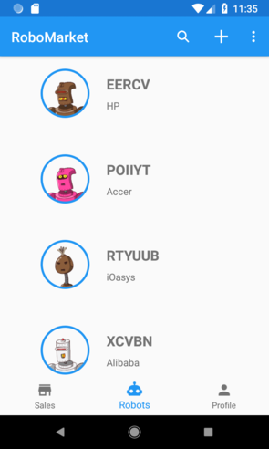
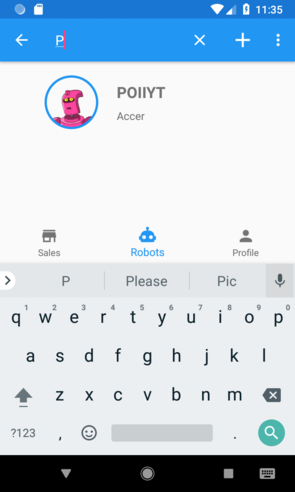
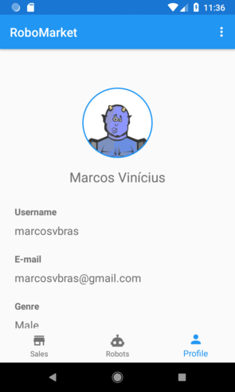
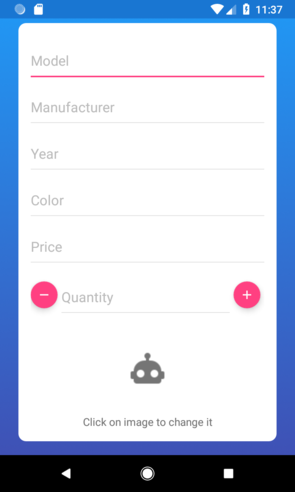

# RoboMarket

A fictitious robot market to practice MVVM design pattern in Android.

  
  

  
  

  
  
  

  

## Description

The project counts with the following features:
- User sign in with username and password
- User sign up
- List and creation of *Sales*
- List and creation of *Robots*
- Profile details and profile edit

The project also counts with:
- MVVM pattern to improve the consistency, legibility and maintainability
- Reactive Programming in API calls
- Integration with [Back4App](https://back4app.com) as back-end
- List items pagination and list reload with SwipeRefreshLayout
- All loaded images are [Robohash](https://robohash.org/) images

And the following dependencies:
- [Retrofit](http://square.github.io/retrofit/) to easy API calls
- [Gson](https://github.com/square/retrofit/tree/master/retrofit-converters/gson) as json parser
- [Groupie](https://github.com/Genius/genius-groupie) to easy item adapter binding
- [RxJava](https://github.com/ReactiveX/RxJava) and [RxAndroid](https://github.com/ReactiveX/RxAndroid) to Reactive Programming
- [Glide](https://github.com/bumptech/glide) as image loader
- [Android Architecture Components](https://developer.android.com/topic/libraries/architecture/)'s ViewModel
